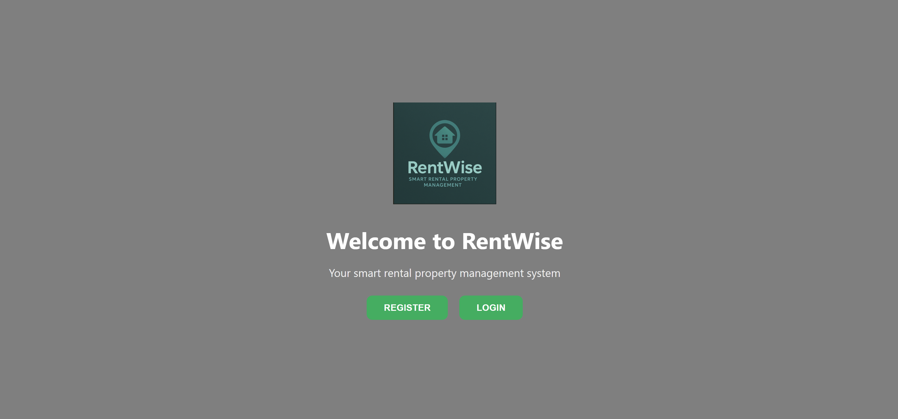
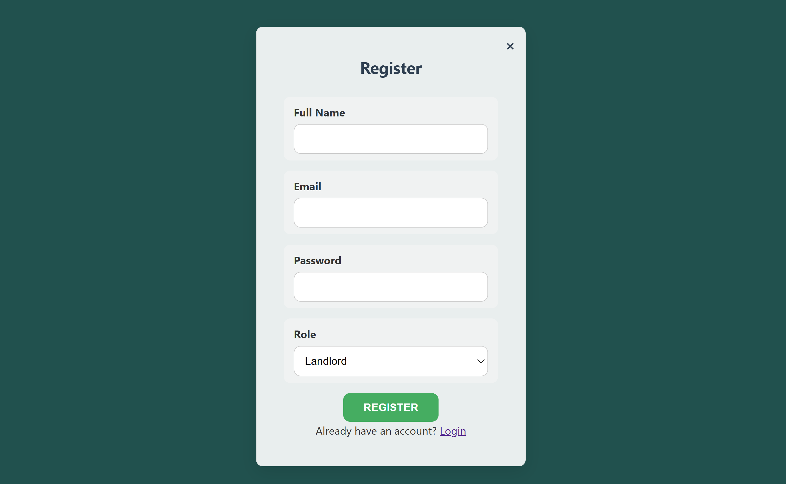
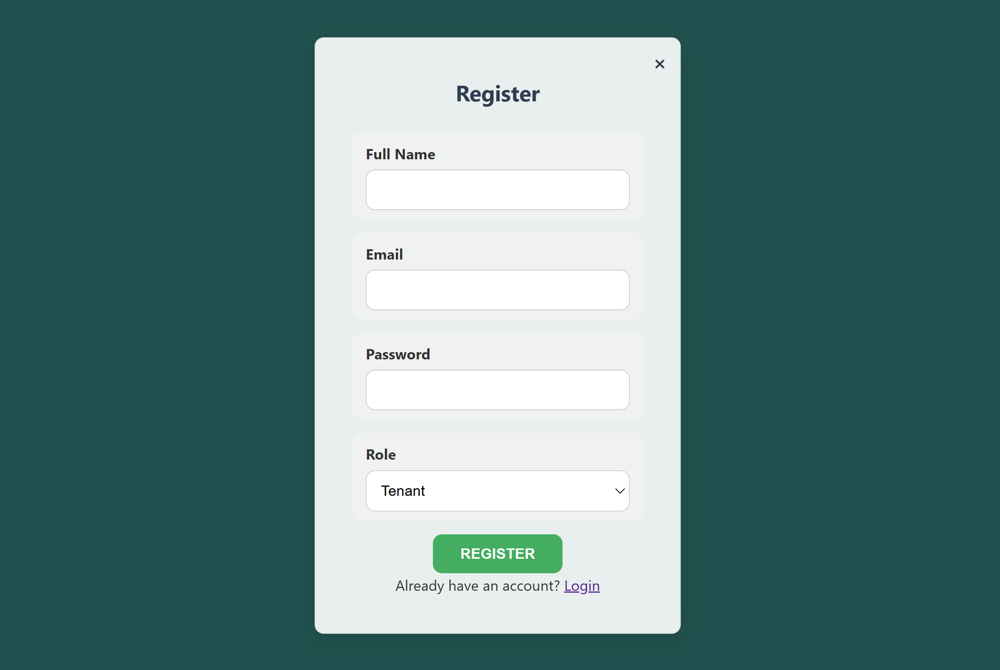
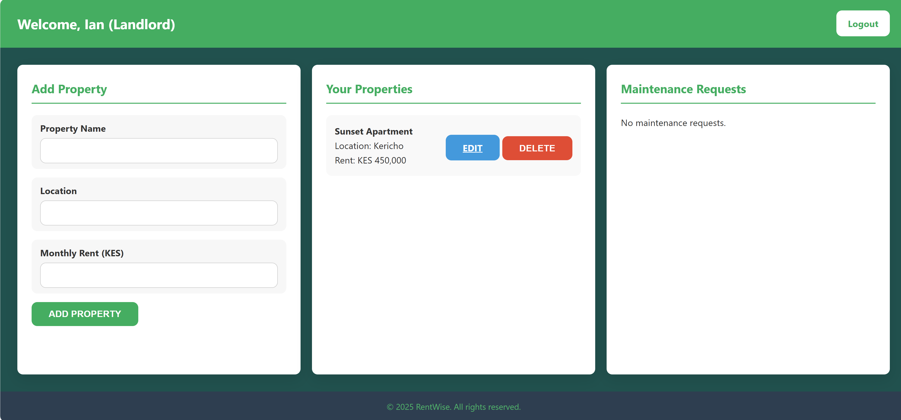
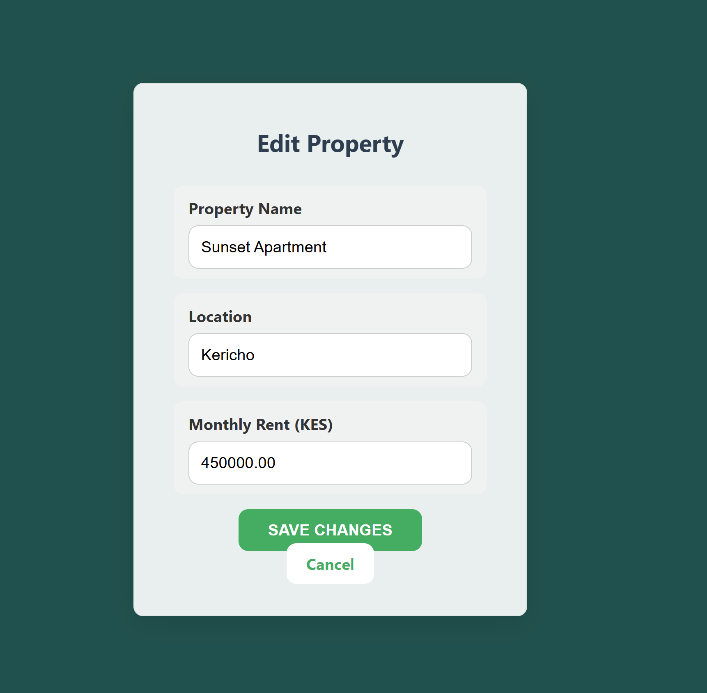
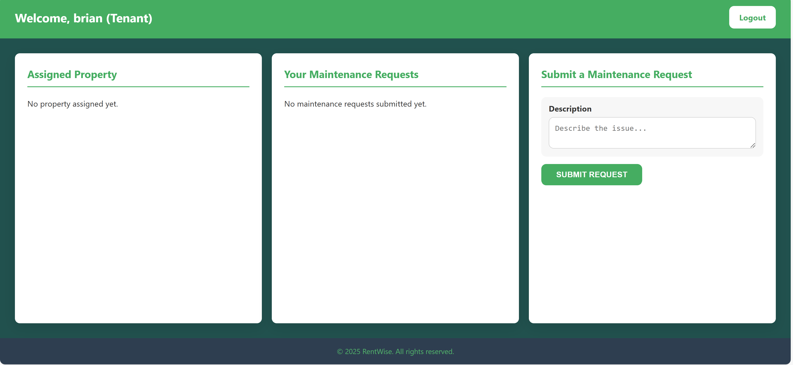

# RentWise--Smart-Rental-Property-Management-System
RentWise is a full-stack web application designed to simplify rental property management for landlords and tenants. It allows landlords to manage properties, assign tenants, and track maintenance requests, while tenants can view property details and submit maintenance issues—all from an intuitive dashboard.

## 🚀 Features

### 🔑 Authentication
- Secure login/register system with role-based access (Landlord / Tenant)
- Session management using MySQL-based session store

### 🏠 Landlord Dashboard
- Add, edit, and delete properties
- Assign tenants to properties
- View all owned properties and their status
- Track maintenance requests submitted by tenants

### 🧍‍♂️ Tenant Dashboard
- View assigned property
- Submit maintenance requests
- View submitted request history and status updates

### 🛠 Maintenance Management
- Landlords can see and manage maintenance requests
- Tenants can submit maintenance issues and track resolution

## 🛠 Tech Stack

| Layer         | Technology                 |
|---------------|-----------------------------|
| Frontend      | HTML, CSS (custom styling), EJS |
| Backend       | Node.js, Express.js          |
| Database      | MySQL                        |
| Session Store | express-mysql-session        |
| Auth & Hash   | bcryptjs, express-session    |

## 📁 Project Structure

RentWise/
├── server.js
├── package.json
├── routes/
├── controllers/
├── models/
├── views/
├── public/
├── .env.example
└── README.md

## ⚙️ Setup Instructions

### 1. Clone the repository
bash
git clone https://github.com/IanKibiwott/RentWise--Smart-Rental-Property-Management-System.git
cd RentWise

### 2. Install dependencies
npm install
### 3. Create .env file
PORT=3000
DB_HOST=localhost
DB_USER=root
DB_PASSWORD=yourpassword
DB_NAME=rentwise
SESSION_SECRET=your-secret-key
### 4. Create MySQL database
Run the following SQL in MySQL:
CREATE DATABASE rentwise;

-- Create 'users', 'properties', 'tenant_property', and 'maintenance_requests' tables
### 5. Run the app
node server.js
📷 Screenshots

### 📜 License
MIT License

## 👨‍💻 Author
IAN KIBIWOTT –  Backend Developer
Contact: iankibiwott576@gmail.com
LinkedIn: www.linkedin.com/in/ian-kibiwott-456900189

